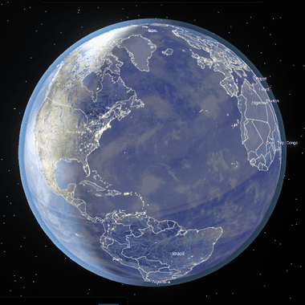
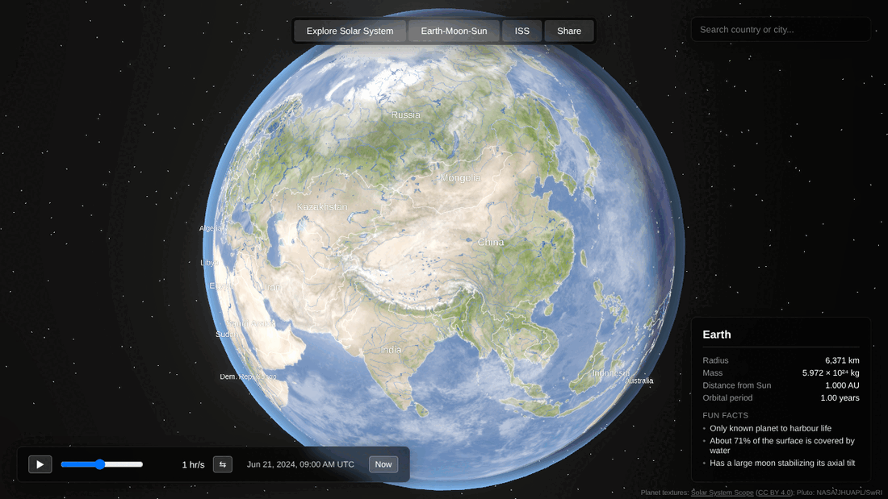
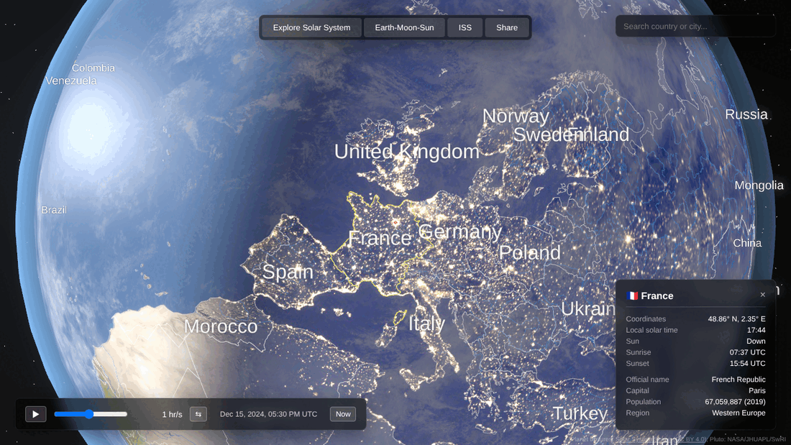
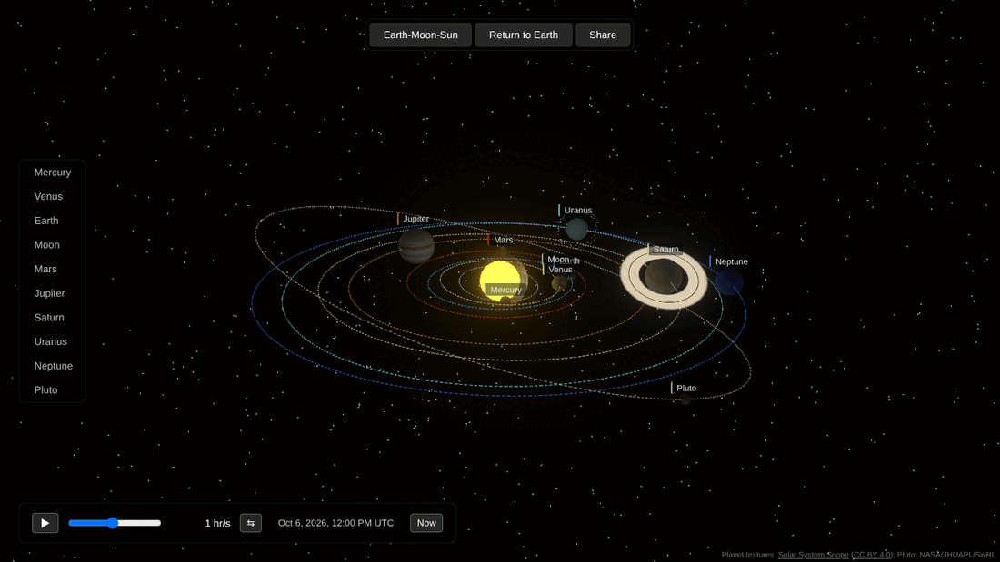
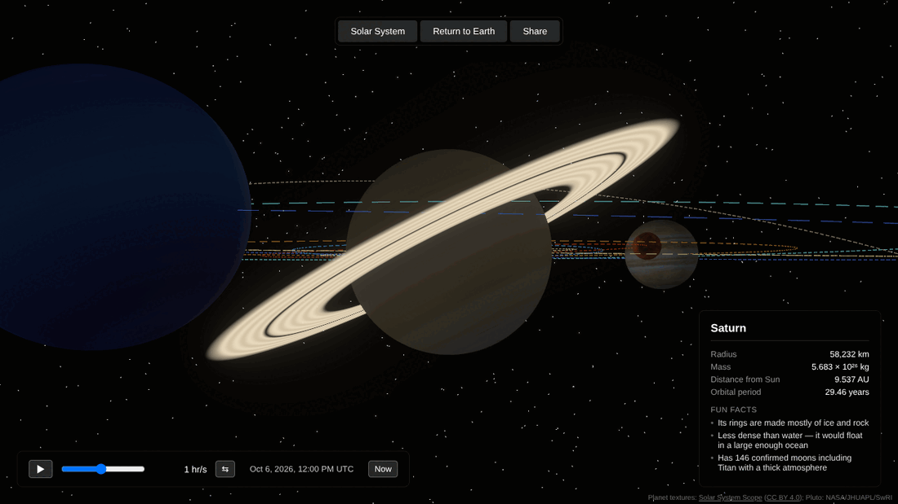
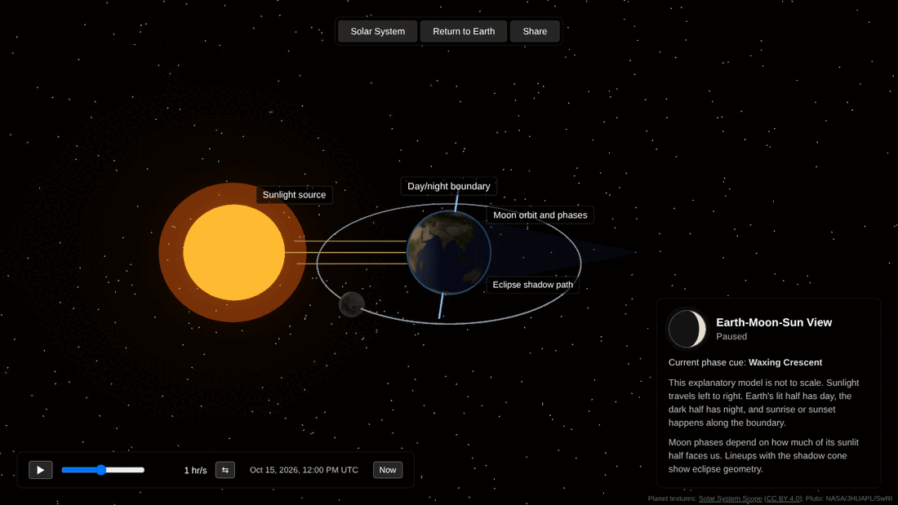

<div align="center">

# 🌍 Earth Explorer

### _The whole planet in a browser tab. Spin it. Light it. Fly past Saturn. Rewind a year in a second._



**Real sunlight. Real tilt. Real orbits. Real ISS.**
A love letter to the pale blue dot, built with React Three Fiber.

</div>

---

## ✨ What this is

Somewhere right now the sun is rising over a fishing village. It's midnight in a desert city
that glows like a circuit board, and the ISS is going overhead at 28,000 km/h. Earth Explorer
shows you all of that at once, accurate to the minute.

It's not a pretty spinning ball with a fake shadow. The day/night line sits where it really is.
The axis leans 23.44° toward the right stars. Seasons come from orbital mechanics, not from a
lookup table. The planets move along their Keplerian ellipses on today's date, or on any date
you pick.

<p align="center">
  
</p>

## 🚀 Things you can do

|                                   |                                                                                                                                     |
| --------------------------------- | ----------------------------------------------------------------------------------------------------------------------------------- |
| 🌗 **Watch the terminator crawl** | The day/night boundary, seasons, axial tilt and city lights all match the simulated moment, down to the minute.                     |
| ⏩ **Bend time**                  | Run from real time up to **a year per second**. Reverse it. Freeze it. Jump to your birthday or the next solstice.                  |
| 📍 **Drop a pin anywhere**        | Click the globe (or search ~1,250 cities and every country) for local solar time, sunrise, sunset, and polar day or night.          |
| 🛰️ **Track the ISS live**         | Switch on the real-time feed and watch the station cross the globe.                                                                 |
| 🪐 **Leave home**                 | Fly through a log-scaled Solar System where every planet sits on its true orbit, and the camera rides along with whatever you pick. |
| 🌒 **Understand the sky**         | The Earth-Moon-Sun teaching view shows the real Moon phase, the season, and the geometry behind eclipses.                           |
| 🔗 **Share a moment**             | One click copies a link to exactly what you're seeing: the view, the instant, and the pin.                                          |

<p align="center">
  
  <br />
  <em>Five-thirty on a December evening. Europe has already switched its lights on. Paris is pinned: the sun set at 15:54 UTC.</em>
</p>

<table>
  <tr>
    <td width="50%"></td>
    <td width="50%"></td>
  </tr>
  <tr>
    <td align="center"><em>The Solar System on 6 October 2026, every planet where it really is.</em></td>
    <td align="center"><em>Saturn up close. It would float in a big enough bathtub.</em></td>
  </tr>
  <tr>
    <td colspan="2"></td>
  </tr>
  <tr>
    <td colspan="2" align="center"><em>The Earth-Moon-Sun view: sunlight from the left, the real tilt, and a waxing crescent.</em></td>
  </tr>
</table>

## 📜 A very short history of putting the world on a table

People have been trying to hold the planet in their hands for well over two thousand years.

- **~240 BC: Eratosthenes measures the Earth.** He compared noon shadows at Syene and
  Alexandria, and with a stick, a well and some geometry got the planet's circumference close to
  the right answer. Nobody needed a satellite to know the world was round.
- **~150 BC: Crates of Mallus builds a globe.** It's the first one on record. His Earth was
  split into four continents, three of them pure speculation.
- **~100 BC: the Antikythera mechanism.** A shoebox of bronze gears, pulled from a shipwreck in
  1901, that predicted Moon phases and eclipses. It's the ancestor of this app's Earth-Moon-Sun
  view, two millennia early.
- **1492: Martin Behaim's _Erdapfel_.** "Earth apple" is the oldest terrestrial globe that
  still survives. It was finished just before Columbus came back from the Americas, so it
  doesn't show them. Every globe is a snapshot of what we know at the time.
- **1609–1619: Kepler's laws.** Orbits are ellipses, not perfect circles. Every planet in this
  app moves by solving Kepler's equation with Newton-Raphson iteration, many times a second.
- **~1704: the orrery.** George Graham and Thomas Tompion built a clockwork model of the Solar
  System, and a copy made for Charles Boyle, 4th Earl of Orrery, gave the whole genre its name.
  Turn a crank and the planets go round. This app is an orrery with a time slider.
- **1968: _Earthrise_.** Apollo 8 rounds the Moon and Bill Anders photographs a blue Earth
  rising over a grey horizon. It's often credited with helping start the modern environmental
  movement.
- **1972: _The Blue Marble_.** Apollo 17 takes a photo of the fully lit globe, probably the most
  reproduced image in history. The day-side texture here is its digital descendant.
- **1990: _Pale Blue Dot_.** Voyager 1 looks back from six billion kilometres away and Earth is
  less than a pixel. Carl Sagan: _"That's here. That's home. That's us."_
- **2000: the ISS gets residents.** People have lived in orbit without a break since 2 November 2000. The yellow dot on the globe is that streak, still going.
- **2012: _Black Marble_.** NASA's Suomi NPP satellite maps Earth's city lights in remarkable
  detail. That's the glow you see as the terminator rolls over continents.

Earth Explorer stands on the shoulders of all of them. It's a globe, an orrery and a planetarium
at once, and it fits in a browser tab.

## 🔭 How it works

- **Sunlight**: Earth's heliocentric position comes from J2000 Keplerian elements. The Sun's
  direction drives a custom GLSL shader that blends the day texture, the night lights, ocean
  glint, a Fresnel atmosphere and drifting clouds, all lit in world space.
- **Spin and tilt**: the globe turns by the **Earth Rotation Angle**, a close relative of
  Greenwich sidereal time, and leans at the J2000 obliquity of **23.4392911°**. The subsolar
  point, sunrise and sunset are all worked out from that same orientation, so the side panel
  always agrees with what the globe shows.
- **Orbits**: planets follow their real ellipses. Distances are compressed on a log scale and
  radii by r<sup>0.4</sup>, so Pluto and Jupiter both fit on screen and you can still see
  Mercury.
- **Time**: one shared simulation clock runs everything. Pause it and the whole universe holds
  its breath.

## 🧰 Tech stack

- **Vite + React 19 + TypeScript**
- **Three.js** with **React Three Fiber**, **@react-three/drei** and **@react-spring/three**
- **@react-three/postprocessing** for bloom
- **Zustand** for app state
- **Vitest** + **Playwright** for tests

## 🛠️ Development

```bash
npm install
npm run dev        # Start the dev server → http://localhost:5173
npm run build      # Production build
npm run check      # Lint, typecheck, test, format
npm run test:e2e   # Playwright end-to-end tests
```

```
src/
├── components/   R3F scene pieces: Earth, planets, Sun, stars, HUD panels
├── shaders/      GLSL for the Earth's surface, atmosphere, clouds and the Sun's corona
├── lib/          Orbital mechanics, Earth orientation, sun times, share links
├── store/        Zustand app state
└── data/         Orbital elements, countries, cities, body facts
```

## 🙏 Credits

Planet and Moon textures are from [Solar System Scope](https://www.solarsystemscope.com/textures/)
(based on NASA imagery), licensed under [CC BY 4.0](https://creativecommons.org/licenses/by/4.0/),
via Wikimedia Commons.

The Pluto texture is derived from the New Horizons global mosaic (NASA / JHUAPL / SwRI, via
USGS Astrogeology; public domain). It has been tinted, and the southern region New Horizons never
imaged has been filled with a neutral tone.

Country borders, country details and city locations come from [Natural Earth](https://www.naturalearthdata.com/)
(public domain). The live ISS position is provided by [wheretheiss.at](https://wheretheiss.at/).

---

<div align="center">

_Go find your house. Then find it at midnight. Then find it in 1492._ 🌏

</div>
